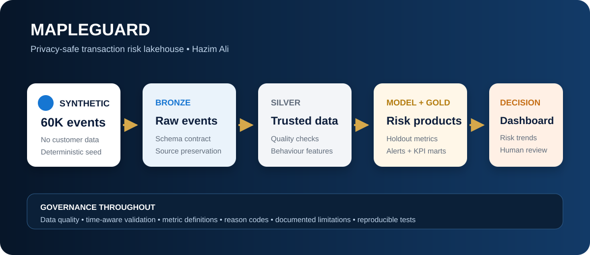
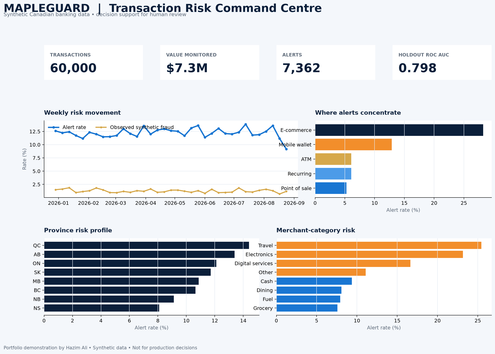

# MapleGuard — Banking Transaction Risk Lakehouse

[](https://github.com/HazimAli07/mapleguard-banking-risk-lakehouse/actions/workflows/ci.yml)
[](https://hazimali07.github.io/mapleguard-banking-risk-lakehouse/)
[](DATA_NOTICE.md)



MapleGuard is a privacy-safe, end-to-end banking analytics portfolio project built by **Hazim Ali**, a Sheridan Artificial Intelligence student open to a **Winter 2027 co-op**.

It turns deterministic synthetic Canadian transaction data into governed Bronze, Silver, and Gold data products; trains and evaluates a transparent transaction-risk model; prioritizes a human-review alert queue; and powers an executive Databricks dashboard. The [public case study](https://hazimali07.github.io/mapleguard-banking-risk-lakehouse/) is the recruiter-facing view; the interactive Databricks workspace version requires sign-in.

> **Responsible-use note:** All records are synthetic. This project is a learning and portfolio demonstration—not a production fraud, credit, or customer-decision system.



## Validated local run

| Check | Result |
|---|---:|
| Synthetic transactions | 60,000 |
| Monitored value | $7.31M CAD |
| Holdout rows | 18,000 |
| Holdout ROC AUC | 0.798 |
| Holdout recall | 0.542 |
| Holdout precision | 0.053 |
| Holdout false-positive rate | 0.118 |
| Automated tests | 2 passed |

The low precision and elevated false-positive rate are intentionally visible: this is a realistic operational trade-off to investigate, not a metric to hide. These results describe synthetic data only.

## Why this project exists

A live scan of Winter 2027 bank postings found a consistent candidate profile: Python and SQL, BI storytelling, data pipelines, data quality, risk awareness, model evaluation, automation, stakeholder communication, and the ability to translate complex analysis into a clear recommendation. MapleGuard demonstrates those capabilities in one coherent banking use case. See the [evidence matrix](docs/bank_requirements_matrix.md).

## What the project demonstrates

- **Data engineering:** reproducible ingestion, validation, enrichment, and medallion modelling
- **Analytics engineering:** durable Gold KPI tables and documented business definitions
- **Machine learning:** time-aware validation, class-imbalance handling, threshold selection, and holdout metrics
- **Risk operations:** prioritized alerts, transparent reason codes, and human-review workflow
- **Business intelligence:** recruiter-friendly KPIs, trends, segments, and drill-down tables
- **Communication:** explicit assumptions, limitations, data lineage, and decision-oriented documentation

## Lakehouse design

| Layer | Purpose | Main outputs |
|---|---|---|
| Bronze | Preserve synthetic source records | `bronze_transactions` |
| Silver | Validate and enrich behavioural features | `silver_transactions` |
| Gold | Serve decisions, monitoring, and reporting | daily KPIs, segment risk, model metrics, alert queue |

## Dashboard questions

1. How much transaction activity and value did the monitored period contain?
2. Is observed and predicted risk changing over time?
3. Which channels, provinces, and merchant categories concentrate risk?
4. Is the model useful on a time-based holdout set?
5. Which alerts should an analyst review first, and why?

## Repository map

```text
databricks/  Databricks source notebook and dashboard SQL
docs/        Architecture, research evidence, dashboard blueprint, preview
notebooks/   Reader-facing local analysis notebook
scripts/     One-command local build and notebook generator
src/         Deterministic data, model, Gold marts, and visualization code
tests/       Data-contract and model-quality checks
```

## Run locally

```bash
python -m venv .venv
source .venv/bin/activate
pip install -e ".[dev]"
python scripts/run_local.py
pytest -q
```

The build writes generated data and metrics under `data/generated/` and creates a local QA preview at `docs/mapleguard_dashboard_preview.png`.

## Run in Databricks

1. Import `databricks/MapleGuard_Lakehouse.py` as a source notebook.
2. Attach serverless or a cluster and run all cells.
3. The notebook creates the `mapleguard` schema plus Bronze, Silver, and Gold Delta tables.
4. Create a Lakeview dashboard using `databricks/dashboard_queries.sql` and the layout in `docs/dashboard_blueprint.md`.

No secret, external API, paid dataset, or customer data is required.

## Model-governance choices

- The train/validation/test split follows event time to reduce look-ahead leakage.
- The alert threshold is selected on validation data and evaluated once on the holdout period.
- Class weights address the intentionally rare positive class.
- Reason codes explain behavioural conditions; they do not claim causal explanations.
- Precision, recall, F1, ROC AUC, average precision, and false-positive rate are monitored together.

## Limitations

- Synthetic patterns are simpler than real financial behaviour and cannot establish production performance.
- The generated label reflects the assumptions in the simulator.
- No fairness, privacy, security, adversarial, or drift certification is implied.
- A real deployment would require bank-approved controls, representative data, monitoring, and human governance.

## About the author

**Hazim Ali** — Artificial Intelligence student at Sheridan College, open to Winter 2027 co-op opportunities in data, analytics, AI, risk, and technology.
